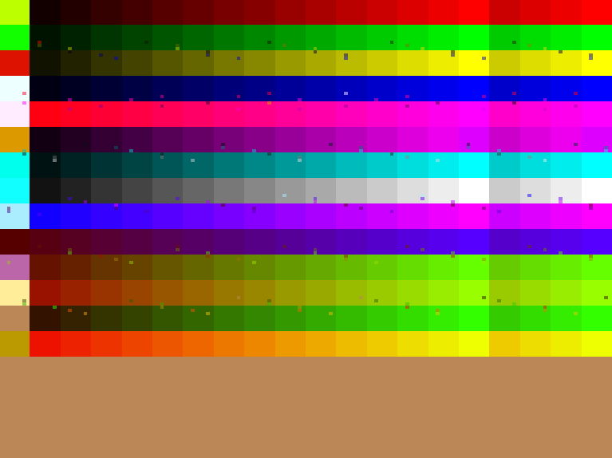

# color-demo
A simple raster effect demo for the Game Gear

# What is this?
The Game Gear video display processor, or just VDP, has a mode where
it can trigger an interrupt to the main processor as it draws the
screen. The VDP draws left to right, top to bottom, and when it hits
the end of the screen, if the mode is enabled, the Z80 (the main
processor) will receive an interrupt.

This demo uses that interrupt to refresh the palette during the frame
seven times. This is what is known as a raster effect. Using the
sprite and tile palettes, it achieves a total of 224 unique colors on
screen. This is not without cost, in the form of the little dots you
see below:

These are CRAM dots, and they are a side effect of how the VDP handles
mid-frame palette swaps. It's present in all 8- and 16-bit Sega VDPs,
and there's no way to stop it---instead, we have to get creative, like
[adding sprites to cover them
up](https://s3unlocked.blogspot.com/2017/05/theres-something-in-water.html).
